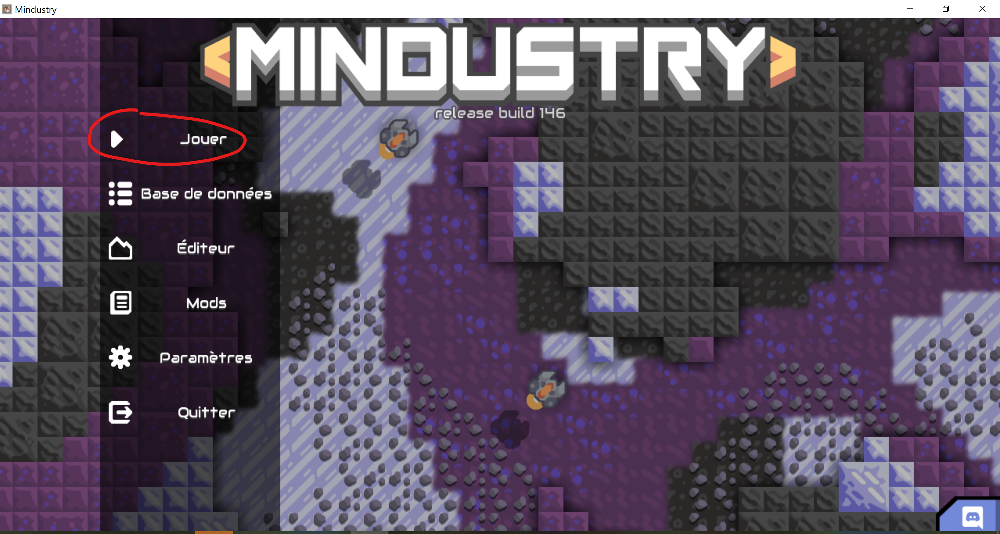
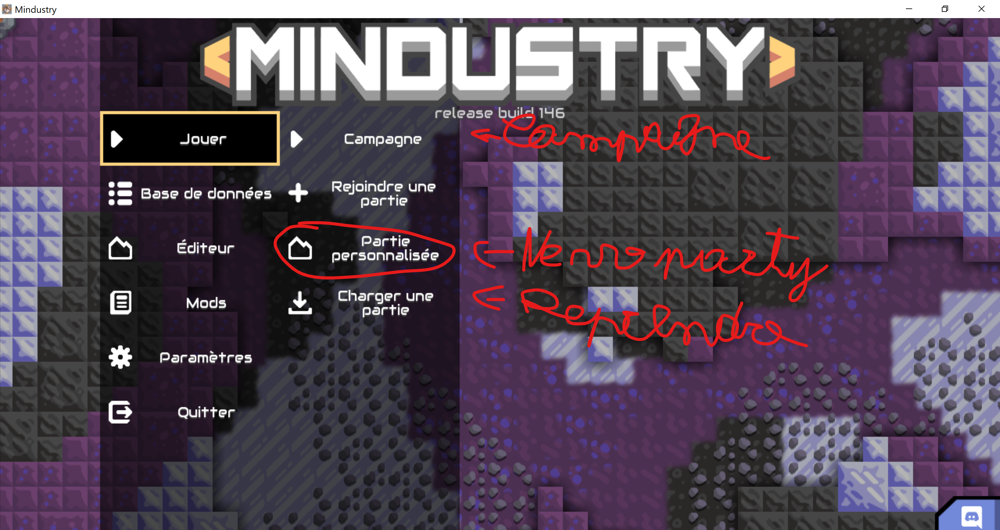
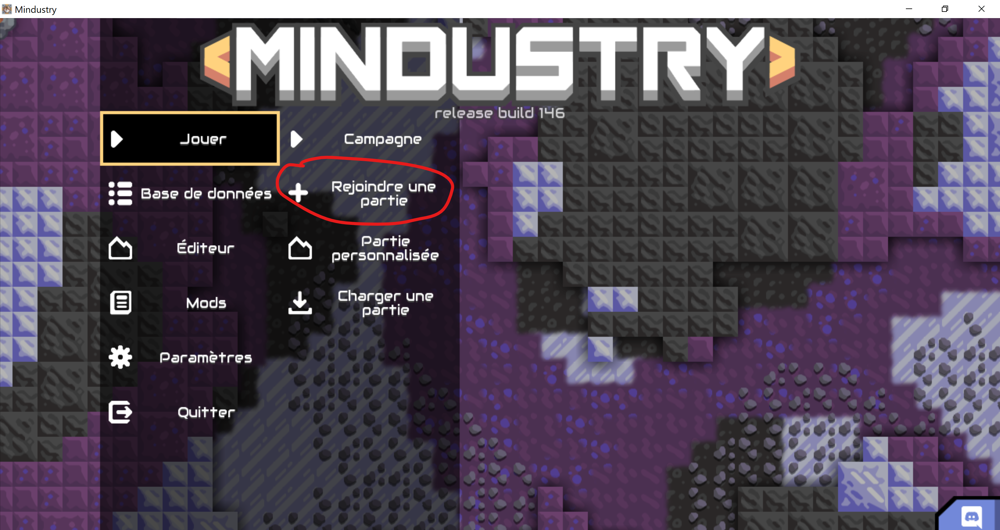

# Comment installer et jouer à Mindustry
## 1.Installer Minstustry
1. Ouvrir **Logitech** (le gestinnaire d'application).
2. Rechercher **Mindustry** et sélectioner la version Snap.
3. Clicker sur **installer**.
## 2.Jouer à Mindustry
1. Lancer le jeu.
2. Clicker sur **Jouer**.
3. ---
|Jouer en solo|Jouer en Multi(Avec Marius)|
|:---:|:---:|
||
|Dans le mode campagne il deux planet sur les quel tu vas pouvoir découvrir les mécanique de jeu, ...   Les deux autre permet de jouer avec toutes les blocs, Unités, ...| Le bouton Rejoindre une partie permet d'en rejoindre une en multi si mon sever est ouvert il apparetera dans la première zone (server locaux)|
4. Commande [Controle clavier](https://defkey.com/mindustry-pc-shortcuts)
.png).png).png).png).png)
